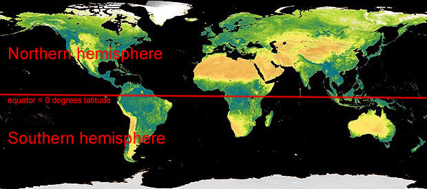

```{r setup, include=FALSE}
knitr::opts_chunk$set(echo = TRUE)
```
  
# 1. Data Analysis
>Data shows the **changes in global temperature** from 1800 to 2014 relative to the mean global temperature(**14&deg;C**) of the base period(1951-1980). Other variables include the temperature changes in the Northern, Southern hemispheres and also in several specific geographical locations (labeled by GPS coordinates). 

```{r}
data=read.csv("temp-year.csv", header = TRUE)
head(data[1:9])
```


# 2. Data Processing
>All temperature changes are converted to the absolute temperature(celcius)

```{r}
data=read.csv("temp-year.csv", header = TRUE)
data[, 2:15] <- data[, 2:15] / 100+14                         
names(data) <- gsub('[.]', '-', gsub('X', '', names(data)))
head(data[1:9])
```


# 3. Data Visualization
## a. Global Temperature (1880-2014) 
```{r}
library(ggplot2)
ggplot(data, aes(x=Year, y=Glob)) +
geom_line(color="red") +
geom_hline(yintercept=14, color="yellow") +
ylab("Temperature (Celcius)") +
geom_segment(aes(x = 1880, y = 13.81, xend = 1975, yend = 14)) +
geom_segment(aes(x = 1975, y = 14, xend = 2014, yend = 14.75))
```

## Observations
> * Since 1880 the average Global temperature on Earth has increased by       approximately **0.8&deg;C**
* The rate of global temperature change has notably increased since 1975

## b. Northern vs Southern Hemisphere Temperature (1880-2014) 
```{r}
ggplot(data, aes(x=Year)) +
geom_line(aes(y =NHem, colour = "Northern Hemisphere")) +
geom_line(aes(y =SHem, colour = "Southern Hemisphere")) +
geom_line(aes(y =Glob, colour = "Global")) +
geom_hline(yintercept=14, color="yellow") +
ylab("Temperature (Celcius)") +
theme(axis.text=element_text(size=12),
axis.title=element_text(size=14),
plot.title=element_text(size=20, face="bold"))
```

```{r echo=FALSE, out.width='100%'}

```

## Observations
> * Both the maximum and minimum global temperature peaks (since 1880) were recorded in the Northern Hemisphere. 

## c. Temperature Change vs Longitude (1880-2014)
```{r}
data1=read.csv("temp-year.csv", header = TRUE)
data1[, 2:15] <- data1[, 2:15] / 100 
ggplot(data1) +
geom_point(aes(x="1",y =X64N.90N, color="1) 64N-90N")) +
geom_point(aes(x="2",y =X44N.64N, color="2) 44N-64N")) +
geom_point(aes(x="3",y =X24N.44N, color="3) 24N-44N")) +
geom_point(aes(x="4",y =EQU.24N, color="4) EQU-24N")) +
geom_point(aes(x="5",y =X24S.EQU, color="5) 24S-EQU")) +
geom_point(aes(x="6",y =X44S.24S, color="6) 44S-24S")) +
geom_point(aes(x="7",y =X64S.44S, color="7) 64S-44S")) +
geom_point(aes(x="8",y =X90S.64S, color="8) 90S-64S")) +
ylab("Temperature Change (Celcius)") +
xlab("Longitude Range")
```        

```{r}
library(tidyr)
data3=read.csv("temp-year.csv", header = TRUE)
t <- gather(data3, value = "Temperature", key = "Longitude", c(X90S.64S, X64S.44S, X44S.24S, X24S.EQU, EQU.24N, X24N.44N, X44N.64N, X64N.90N))
t$Longitude <- factor(t$Longitude, levels =c( 'X64N.90N','X44N.64N','X24N.44N','EQU.24N','X24S.EQU','X44S.24S','X64S.44S','X90S.64S'),ordered = TRUE )
p <- ggplot(t, aes(x=Year, y=Temperature, fill=Longitude))
p + 
  geom_area( size=2, alpha=.6) + 
  theme_minimal() + 
  scale_fill_brewer(palette='Spectral' ) +
  scale_y_continuous(name ="Temperature Change") +
ggtitle('Global Warming',subtitle = 'Global temperature evolution since 1880')
```  

```{r echo=FALSE, out.width='100%'}
knitr::include_graphics('./long.jpg')
```

## Observations
> * Both the graphs above indicate that the global temperature tends to fluctuate significantly higher in regions close to the poles compared to the regions closer to the equator.  


## d. Monthly temperature changes (1880-2014) 
```{r}
data4=read.csv("temp-month.csv", header = TRUE)
data4=replace(data4, data4=="***", NA)
data4=replace(data4, data4=="****", NA)
data4=na.omit(data4)
t <- gather(data4, value = "Temperature", key = "Month", c(Jan, Feb, Mar, Apr, May, Jun, Jul, Aug, Sep, Oct, Nov, Dec))
t$Month <- factor(t$Month, levels =c( 'Jan', 'Feb', 'Mar', 'Apr', 'May', 'Jun', 'Jul', 'Aug', 'Sep', 'Oct', 'Nov', 'Dec'), ordered = TRUE )
ggplot(t, aes(x=Year, y=Temperature, colour=Month)) + geom_line() + facet_wrap(~ Month) +
ylab("Temperature Change") +
theme(axis.text=element_text(size=8),
axis.title=element_text(size=12),
plot.title=element_text(size=20, face="bold"))
```

**(NOTE FOR PROFESSOR: For some reason the replace & na.omit function doesnt work when I plot a graph in ggplot2. For this, I had to manually delete the rows with NA values.)** 

## Observations
> * The maximum fluctuations in the global temperature occurred in the months of January and December. 


# 4. Acknowledgements
>* [link] http://ashgillman.github.io/Coursera-Data-Visualisation/assignment1.html
* [link] https://earthobservatory.nasa.gov/world-of-change/DecadalTemp
* [link] http://rstudio-pubs-static.s3.amazonaws.com/98444_e07d34be6cc24294b0edfa66613c6c65.html
* [link] https://data.giss.nasa.gov/gistemp/tabledata_v3/GLB.Ts+dSST.txt
* [link] https://rpubs.com/abelenguer/Week2_Assigment1

